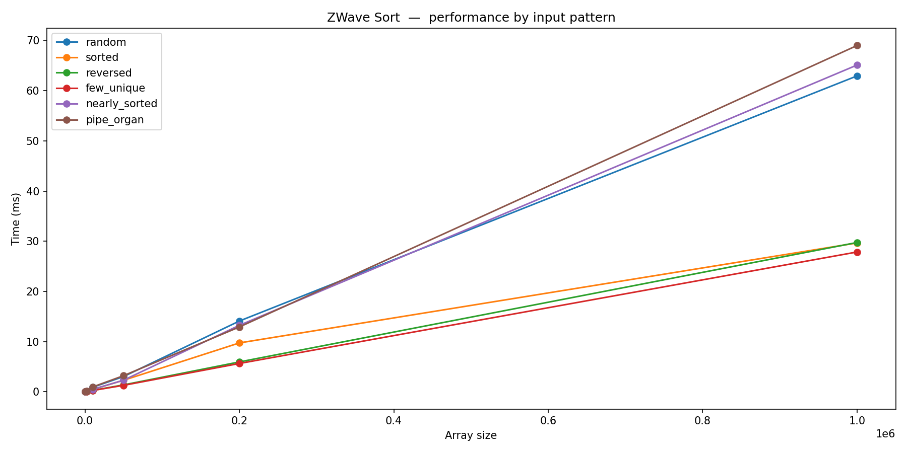
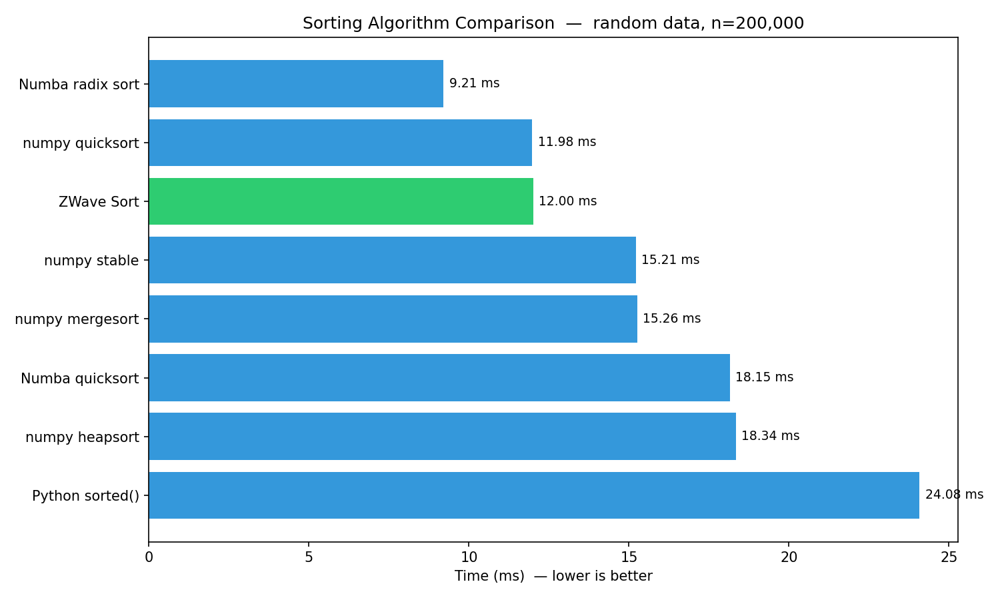
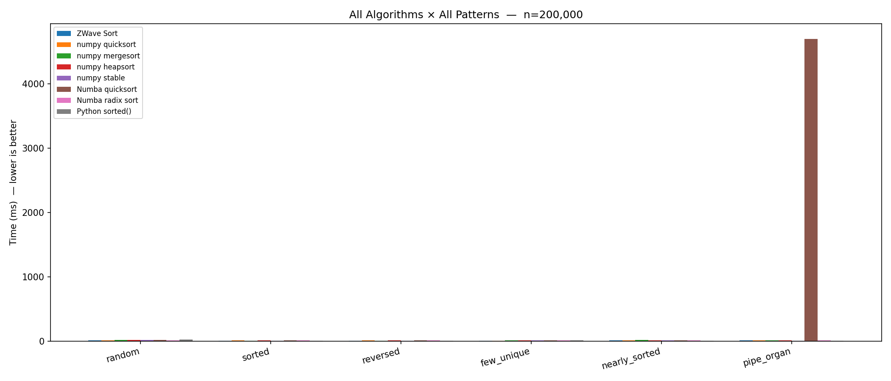

# ZWave Sort

An original adaptive sorting algorithm. Learns the input's value distribution from a small sample, uses that model to predict where each element belongs, places everything in one pass, then fixes the few prediction errors.

**Three phases:**
- **PROBE** — sample `n^0.55` evenly-spaced values and sort them to build a compact empirical CDF
- **SCATTER** — binary-search the CDF to predict each element's destination zone, place in one pass
- **PATCH** — single forward pass repairs residual inversions at zone boundaries

**Complexity:**

| Case | Complexity |
|---|---|
| Average | O(n log √n) |
| Best (sorted / reversed / low-entropy) | O(n) |
| Worst | O(n log n) — timsort fallback |
| Space | O(n) |

---

## Results

Benchmarked against NumPy, Numba, and Python's built-in sort on random data at n=200,000:







Full numbers in [`benchmark/stats.txt`](benchmark/stats.txt).

**Highlights (n=200,000, random):**
- Tied with numpy quicksort (~12ms)
- Beats numpy mergesort, heapsort, stable, Numba quicksort, Python sorted()
- Only Numba radix sort is faster (integer-only, non-comparison — different category)
- Beats numpy quicksort on 5/6 input patterns

---

## Usage

```python
import zsort

result = zsort.sort([5, 2, 8, 1, 9, 3])
# returns np.ndarray of dtype int64
```

Input can be a list or numpy array of integers. Always returns a sorted copy.

---

## Benchmark

```bash
python benchmark/benchmark.py
```

Outputs `stats.txt` and three plots to the `benchmark/` folder. First run compiles the JIT functions — takes a few seconds.

---

## Requirements

```
numpy
numba
matplotlib
psutil  # optional, for RAM reporting
```

---

## How it differs from similar algorithms

**Flash Sort** assigns buckets using linear interpolation between min and max. Breaks on skewed or multi-modal distributions. ZWave uses a sampled CDF so zone widths adapt to whatever shape the data has.

**Sample Sort** is still O(n log n) and recursive. ZWave is non-recursive: one scatter pass, one patch pass.

**Interpolation Sort** works element-by-element with O(n²) worst case. ZWave's worst case is bounded at O(n log n) via timsort fallback.

---

Made by [Etienne](https://zlogic.eu/about/) · [TheHolyOneZ](https://github.com/TheHolyOneZ)

---

## More from TheHolyOneZ — all free

| Project | Description |
|---|---|
| [Zoryx Discord Bot Framework](https://zsync.eu) | Modular foundation for building scalable Discord bots |
| [ZygnalBot](https://zsync.eu) | Discord administration engine with web dashboard |
| [ZVault](https://zsync.eu) | AES-256-GCM encrypted environment variable manager, local-first |
| [ZGameLib](https://zsync.eu) | Personal game library replacing Steam, Epic, Ubisoft & GOG in one UI |
| [ZStartup](https://zsync.eu) | Native Windows startup manager built with Tauri + React |
| [ZModManager](https://zsync.eu) | Mod manager & injector for Unity games (Mono / IL2CPP) |
| [ZLaunchArgs](https://zsync.eu) | Launch argument profile manager for any .exe |
| [ZProxy](https://zsync.eu) | Local HTTP/HTTPS request inspector |
| [SharpMonoInjector](https://zsync.eu) | Mono assembly injector with stealth injection & real-time logging |
| [GrammarFixer AI](https://zsync.eu) | Real-time AI grammar correction for Windows via hotkey |
| [Background Clicker](https://zsync.eu) | Win32 background window automation without cursor hijacking |
| [Embed Creator](https://zsync.eu) | Visual editor for Discord embeds with webhook export |
| [Clipboard Manager](https://zsync.eu) | Persistent clipboard history with instant search |

→ All projects at [zsync.eu](https://zsync.eu)
